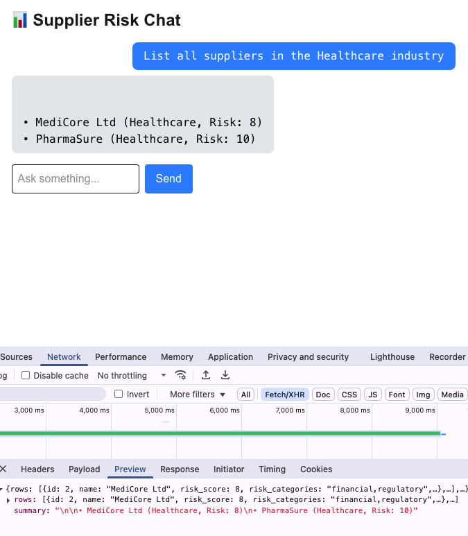
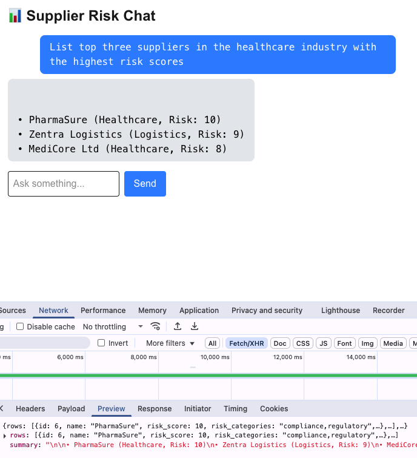

# Supplier Risk Search Tool

Conversational web application that allows users to query a local supplier database in natural language.

---

## Objective

Develop and AI-powered chat interface to provide insights about suppliers:

- Create a database with suppliers and their risk score
- Have an AI chat interface that responds to questions about the supplier information.

---

## Business Impact

- Faster than transcribing all the information.
- Generates Valuable Metadata: Transforms raw uploads into structured data.
- Can act as a Name Entity Recognition (NER) system.

---

## Query strategies

1. **Predefined query routing** (`/api/sql_routing`)

   This approach maps natural language inputs to a set of predefined SQL query templates.

2. **LLM-generated SQL** (`/api/sql_generator`)

   This approach allows the LLM to generate SQL dynamically from the user prompt using the database schema as context and system prompt guidance. It returns a friendly, human-readable summary.

---

## Features

- Conversational UI powered by `@ai-sdk/react`
- Two distinct query strategies:
  - **Predefined query routing** (`/api/sql_routing`)
  - **LLM-generated SQL** (`/api/sql_generator`)
- Human-friendly summaries of SQL query results
- Automatic parameter binding to prevent SQL injection
- Error recovery through LLM fallback prompts
- SQLite for fast local prototyping
- Clean TailwindCSS-based responsive UI

---

## Architectural Overview

The project is built using **Next.js 15 App Router**, integrates the **Vercel AI SDK**, and connects to a local **SQLite** database. A local **Ollama** instance runs a lightweight LLM (`phi3`) for SQL generation.

### Frontend

- `useChat` from the AI SDK handles streaming messages, status, and user input.
- Custom components (`MessageList`, `ChatInput`).
- Messages display summarized query responses instead of raw JSON.

### Backend

Two APIs power the system:

#### 1. `/api/sql_routing`: Predefined Query Router

This approach maps natural language inputs to a set of predefined SQL query templates.

**Pros:**

- Safe and deterministic
- Easy to debug
- Fast execution

**Cons:**

- Limited to known queries
- Requires manual maintenance of patterns and SQL mapping logic

#### 2. `/api/sql_generator`: LLM-Generated SQL

This approach allows the LLM to generate SQL dynamically from the user prompt using the database schema and system prompt guidance.

**Enhancements:**

- Structured output enforced using `format` (no more custom parsing)
- Parameter binding for safer query execution
- Retry mechanism if the SQL fails to execute (reprompts the LLM)
- Summary generation for end-user readability

**Pros:**

- Extremely flexible and scalable
- Zero manual mapping needed
- Leverages schema awareness

**Cons:**

- Potential for hallucinated or invalid SQL
- Slower due to LLM latency

---

## Tech Stack

- **Frontend**: Next.js 15, TailwindCSS, Vercel AI SDK (`@ai-sdk/react`)
- **Backend**: SQLite, Ollama (with `phi3` model), Next.js
- **LLM**: Local `phi3` model running via Ollama with JSON schema formatting
- **UI State**: Handled via `useChat` hook (input, messages, status, error)

---

## Setup Instructions

```bash
# 1. Install dependencies
npm install

# 2. Start Ollama with the desired model
ollama run phi3

# 3. Seed the database
npm run db:seed

# 4. Start the development server
npm run dev
```

---

## Screenshots

**Predefined query routing**



**LLM-generated SQL**



---

## Next steps

- Return a human-readable summary in the routing approach
- Unit testing
